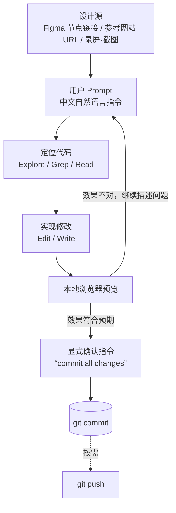

# ReginaWoo
Personal Port folio

---

## index.html 及相关网页创作工作流

本仓库（`index.html`、`FLIGHTBUDDY.html`、`NEXUS.html`、`DANCERS.html`、`CHAOSSTAR.html`、`OW2.html` 等）的开发全程由 Claude Code（配合 Figma MCP）以对话式指令驱动完成。以下记录该协作流程的结构、涉及的节点配置，以及对实际下达指令的语言特征分析，便于后续复用同一套方法维护或扩展页面。

### 1. 工作流结构

核心特点：**需求描述**与**收尾确认**是两个独立动作。修改过程中允许多轮追加式微调（不满意则继续用一句话补充），只有用户明确说"commit"才落盘，避免半成品被提交。

### 2. 节点配置

| 节点 | 角色 | 触发条件 | 工具 / 权限 | 产出 |
|---|---|---|---|---|
| 设计源节点 | 提供视觉真源 | 需要还原设计稿或复现 bug 时 | Figma MCP `get_design_context`（已在 [.claude/settings.local.json](.claude/settings.local.json) 中授权）；或直接粘贴参考网站 URL / 上传截图·录屏 | 结构化设计上下文、色值、字体、组件结构或对比素材 |
| 指令节点（用户） | 描述目标状态 | 每轮对话发起 | 自然语言（中文为主） | 一句到几句话的任务描述 |
| 定位节点（Agent） | 在多文件仓库中锁定目标代码块 | 实现前 | `Grep` / `Read` / `Explore` 子代理 | 精确文件路径与行号 |
| 实现节点（Agent） | 落地 HTML/CSS/JS 改动 | 定位完成后 | `Edit` / `Write` | 代码 diff |
| 验证节点（用户） | 判断效果是否达标 | 实现完成后 | 本地刷新浏览器、对照录屏/截图 | "继续改" 或 "通过" 的反馈 |
| 版本控制节点 | 落盘一次原子提交 | 用户明确说"commit" | `Bash`（`git add` 限定本轮改动文件 + `git commit`），提交信息含 `Co-Authored-By` | 一条 git commit |
| 会话持久化节点 | 保留跨会话上下文 | 全程自动 | `.claude/projects/` 下的会话记录 | 支持同一模块跨天、跨会话继续迭代（例如 Colours 模块的四轮连续指令） |

### 3. Prompt 语言分析

基于历史会话中实际下达的指令，观察到以下几类稳定的句式模式：

| 句式类型 | 示例（原文） | 特点 |
|---|---|---|
| 新增类 | "在index页面的邮箱图标水平左侧添加一个文档图标，当点击文档图标时弹出弹窗询问用户是否要下载…" | 精确空间定位 + 触发条件 + 结果说明，一句话包含完整交互闭环 |
| 替换 / 迁移类 | "将此链接中的内容添加到"colours"的弹窗模块中，确保格式以及风格自适应" | "将 A 添加到/改成 B"句式，并附带风格一致性约束 |
| 类比复用类 | "按同样的标准将Type System板块替换为此链接的内容"／"按照跟colours模块要求一样的逻辑修改Atom Component模块内容" | 显式引用前一个已验证通过的实现模式，降低重复描述成本 |
| 精修 / 去装饰类 | "这个模块中的每一个单独文件外可以不要边框吗"／"它底部的底色也不要" | 短句、连续追加，单次只改一个视觉属性，便于逐条验证 |
| 调试排查类 | "还是没有解决，我的观察是：当卡片为collapse状态的时候…你再检查一下是不是这里的问题" | 用户先给出自己的假设，要求 Agent 验证而非直接甩错误堆栈；常配合录屏/截图佐证 |
| 一致性锚定类 | "整体视觉风格保持和index等网页一致"／"字体放大加粗"（相对现状调整而非绝对数值） | 用已有页面或当前状态做参照系，减少沟通成本 |
| 确认收尾类 | "commit all changes"／"commit changes" | 与内容修改指令解耦的独立收尾信号 |

整体语言特征：

- **中文为主，专有名词保留英文**：模块/图层名称（Colours、Type System、Atom Components、card deck、peeking card）直接沿用 Figma 或代码中的原词，避免翻译造成的歧义。
- **极少解释"为什么"**：多数指令只描述目标状态；只有跨会话的复杂 bug（如 CHAOSSTAR 页面的 LFS 视频线上无法播放问题）才会补充背景说明和已尝试过的排查步骤。
- **空间关系词高频出现**：水平左侧、居中放置、左右两侧、底部、收起状态——用相对位置而非坐标描述布局要求。
- **视觉调整拆成多条单点 prompt**，而非一次性罗列需求，便于每改一步就验证一步。
- **外部链接作为唯一真源**：Figma `node-id` 链接、参考网站 URL、视频嵌入代码等直接粘贴在指令中，减少转述失真。
